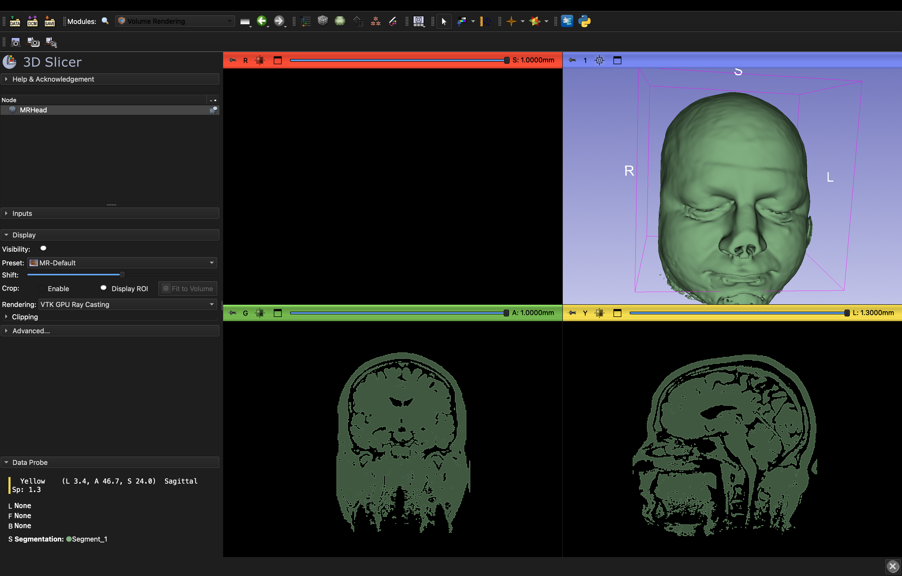
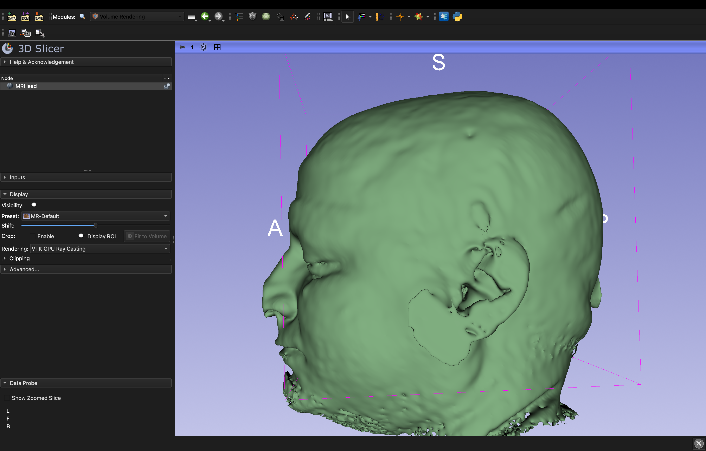

# 3D Brain MRI Segmentation using 3D Slicer

## Project Overview
Performed full 3D head segmentation from MRI data using 3D Slicer. 
Applied threshold-based segmentation to isolate anatomical structures 
and generated interactive 3D surface models from the MRHead dataset.

## Tools & Software
- **3D Slicer** (Stable Release) — open-source medical imaging platform
- **Segment Editor** module — threshold-based segmentation
- **Volume Rendering** module — GPU ray casting (VTK)
- **Data format** — NRRD (Nearly Raw Raster Data)

## Workflow
1. Loaded MRHead MRI dataset in NRRD format
2. Opened Segment Editor and created a new segmentation node
3. Applied **Threshold segmentation** to isolate head/brain tissue by intensity values
4. Generated 3D surface model using "Show 3D" rendering
5. Switched to Volume Rendering module with MR-Default preset
6. Captured multi-planar reconstruction (axial, coronal, sagittal) + 3D views

## Results

### Multi-Planar Reconstruction + 3D View


### Front View — 3D Surface Model


### Lateral View — 3D Surface Model


## Key Concepts Demonstrated
- Medical image segmentation
- 3D surface model generation from volumetric MRI data
- Multi-planar reconstruction (MPR) navigation
- VTK GPU Ray Casting for volume rendering
- NRRD medical imaging format handling
```

---

